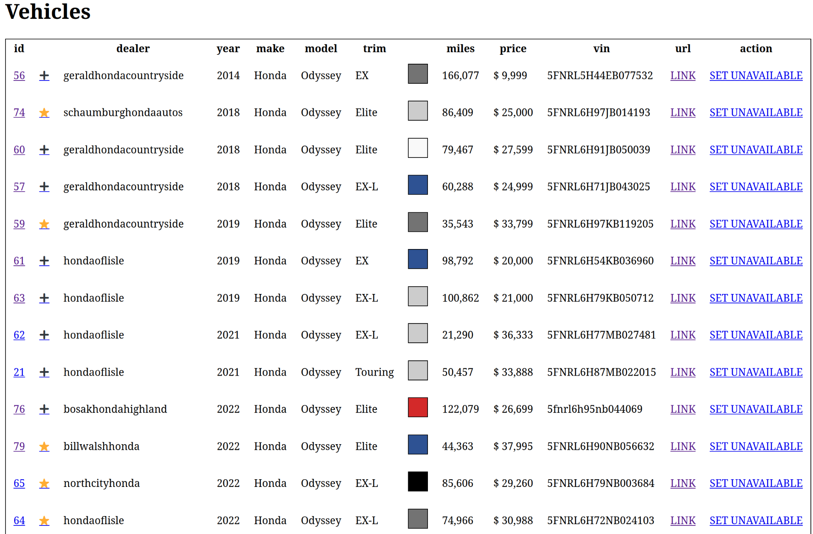
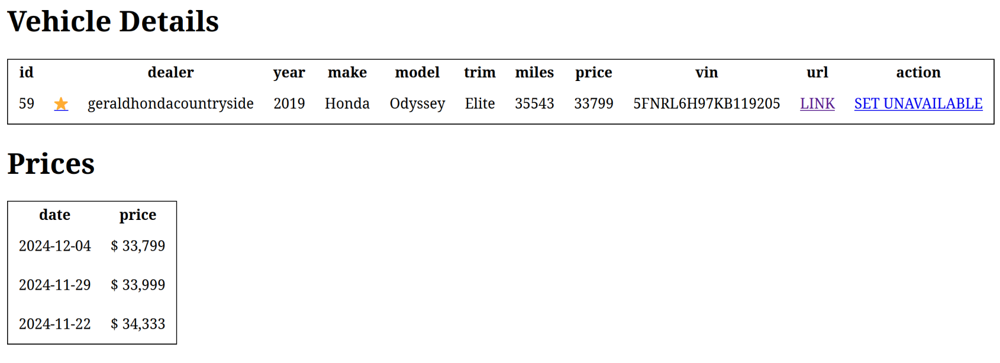

# car-search-web-app

A simple web app to keep track of vehicles for sale.
You're probably better off using a spreadsheet.

## Screenshots

### Main screen

<table>
<tr>
    <td></td>
</tr>
</table>

### Vehicle Details

<table>
<tr>
    <td></td>
</tr>
</table>


## Technical Details

This is a [Scalatra](https://scalatra.org) web app, written in [Scala](https://scala-lang.org),
using [Twirl templates](https://www.playframework.com/documentation/3.0.x/ScalaTemplates), served by
[Jetty](https://jetty.org/index.html    ).

## Requirements

* JDK 8+: can be obtained from [AdoptOpenJDK](https://adoptopenjdk.net/) and other sources.

## Usage

### Database

Start a new Postgres database using `docker-compose`: 

```shell
docker-compose up -d
```

After the database is up, you can restore a database snapshot (if you have one):

```shell
./restore_database.sh <path to .sql.gz backup>
```

### Webapp

Run the web application using:

```shell
./gradlew run
```

Look on the console to see the URL where the web app is listening.

### Backup the database

Run:

```shell
./backup_database.sh
```

## Testing

Unit tests are automatically run as part of the `build` task.  You can access test reports in the `build/reports/test` directory:

```
xdg-open build/reports/test/index.html
```

NOTE: On MacOS, use `open` instead of `xdg-open`.

    